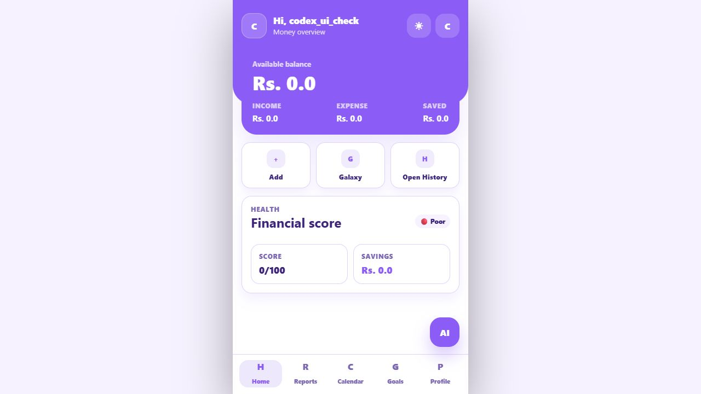
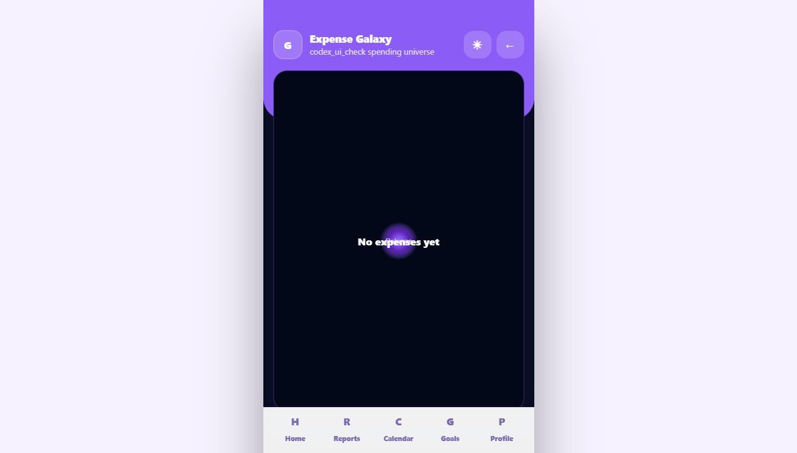

# FinGuard – AI-Powered Personal Finance Management

FinGuard is a **mobile-first personal finance management application** that helps users track expenses, manage financial goals, analyze spending habits, and gain AI-assisted financial insights through an intuitive and interactive interface.

The application is designed with scalability in mind and can be extended into a native mobile application using **Capacitor** in the future.

---

## ✨ Features

- 🔐 Secure user authentication
- 💰 Income and expense tracking
- 📊 Weekly, monthly, and yearly financial analytics
- 🎯 Goal planner with progress tracking
- 🌌 Galaxy-based expense visualization
- 🤖 AI-powered financial chatbot
- 📅 Calendar-based transaction management
- 📝 Transaction categories and subcategories
- 📈 Financial insights dashboard
- 🌗 Light and Dark theme support
- 📱 Mobile-first responsive user interface

---

## 🛠 Tech Stack

### Frontend
- HTML5
- CSS3
- JavaScript

### Backend
- Python
- Flask

### Database
- SQLite

---

## 📂 Project Structure

```
FinGuard/
│── app.py
│── requirements.txt
│── data/
│── static/
│── templates/
│── utils/
```

---

## 🚀 Getting Started

### Prerequisites

- Python 3.10 or later
- pip

### Installation

Clone the repository

```bash
git clone https://github.com/YOUR_USERNAME/FINGUARD-Expense-Tracker.git
```

Move into the project

```bash
cd FINGUARD-Expense-Tracker
```

Install dependencies

```bash
pip install -r requirements.txt
```

Run the application

```bash
python app.py
```

Open your browser

```
http://127.0.0.1:5000
```

---

## 📱 Key Modules

- Dashboard
- Expense Tracker
- Goal Planner
- Expense Galaxy Visualization
- AI Chatbot
- Calendar
- Financial Insights
- Profile Management
- Transaction History

---

## 🏗 Architecture

The application follows a modular Flask architecture:

- **templates/** – HTML pages
- **static/** – CSS, JavaScript, and assets
- **utils/** – Business logic and helper modules
- **data/** – SQLite database
- **app.py** – Main Flask application

---

## 🎯 Future Improvements

- Convert the application into a native Android app using Capacitor
- Cloud synchronization across multiple devices
- AI-powered expense prediction and budgeting recommendations
- Push notifications for bills and savings goals
- OCR support for automatic receipt scanning
- Data export (PDF/Excel)
- Multi-currency support
- Interactive financial reports and charts

---

## 📸 Screenshots

### Home Screen



### Expense Galaxy



---

## 📄 License

This project was developed for educational and portfolio purposes.

---

## 👨‍💻 Author

**Anish R**

GitHub: https://github.com/Ani-Sephora
